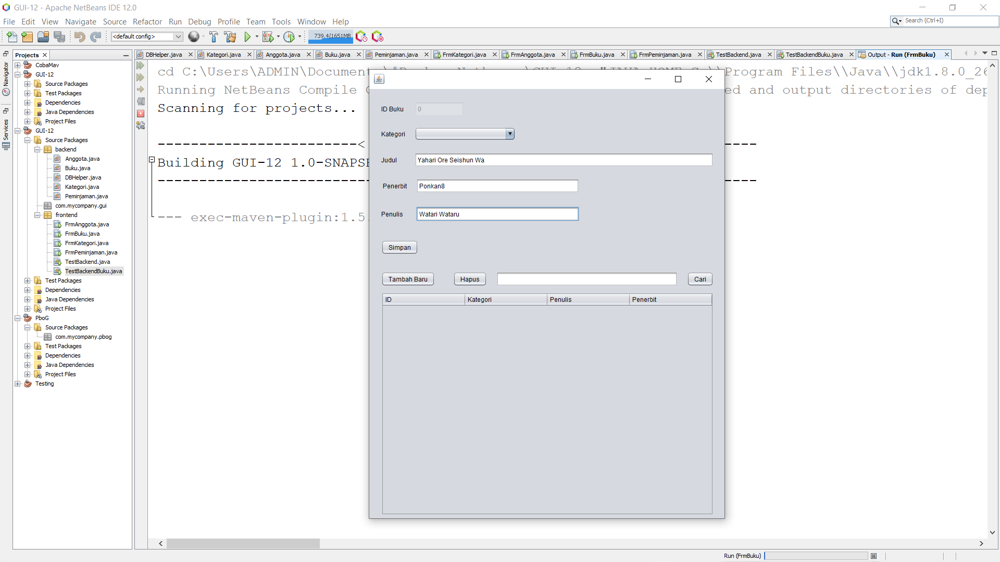

# Laporan percobaan jobsheet

### Nama : Pranata Dito Fitriyansyah

### Kelas : 2C

### No. Absen : 17

## Percobaan 1 : Membuat Database
(Untuk semua id sudah saya Auto Increment dan juga saya beri relasi)

## Percobaan 2, 3 , 4 dan 5: 

Mengimport Mysql JDBC Driver dan membuat package backend dan frontend yang berisi Class DBHelper untuk koneksi kemudian Kategori untuk tabel kategori dan TestBackend untuk mengetest

Namun terdapat error : (Saya sudah coba semua pak, di netbeans 8.2 juga terdapat error dan di netbeans 12.0 juga terdapat error yang sama, padahal sudah saya cek dan sama persis seperti yang ada di jobsheet ), berikut errornya :

        com.mysql.jdbc.exceptions.jdbc4.MySQLSyntaxErrorException: You have an error in your SQL syntax; check the manual that corresponds to your MariaDB server version for the right syntax to use near ')' at line 1

Error pada Netbeans 8.2 dengan JDBC driver :

Error pada Netbeans 12.0 dengan Java Maven :

## Percobaan 6 ,7 dan 8 : Membuat JForm untuk Kategori dan Anggota, dan juga class Anggota serta class Buku
Dikarenakan tidak bisa connect ke mysql seperti yang saya jelaskan di atas, alhasil tidak muncul data

JForm Kategori :

JForm Anggota :

## Percobaan 8.2 : Membuat JForm Buku :
Sama seperti JForm Kategori dan Anggota, dikarenakan tidak bisa connect ke mysql, alhasil tidak muncul data

## Jadi intinya disini kendala saya yaitu tidak bisa connect ke mysql servernya pak, saya sudah coba berbagai cara, namun output yang dikeluarkan selalu error, ada juga yang outputnya 'Error Koneksi!' namun error yang dikeluarkan lebih banyak dari yang saya sebutkan seperti di atas