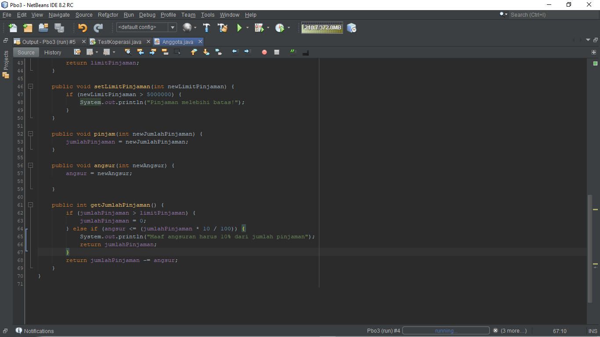

# Laporan Praktikum Pertemuan 3

### Nama : Pranata Dito Fitriyansyah

### Kelas : 2C

### No. Absen : 17

## Output program

Berikut adalah jawaban tugas dari jobsheet 3 enkapsulasi :

1. Hasil output :
   
   Kode :
   
   

2. Dikarenakan pada method setAge di deklarasikan jika newAge lebih dari 30 maka hasil keluarannya yaitu 30 karena yang diinputkan yaitu 35

3. Modifikasi :
   
   
   Hasil :
   

4. Hasil kode :

    
    
   Output :
    

5. Modifikasi :
   

6. Modifikasi :
   
   Output :
   
