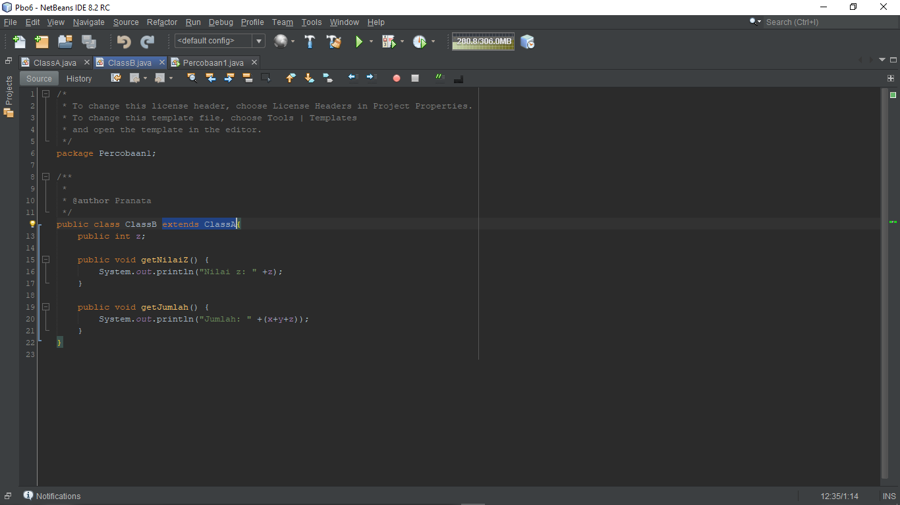

# Jawaban Pertanyaan Jobsheet 6

### Nama : Pranata Dito Fitriyansyah

### Kelas : 2C

### No. Absen : 17

## Pertanyaan percobaan 1

1. Pada percobaan 1 diatas program yang dijalankan terjadi error, kemudian perbaiki sehingga program tersebut bisa dijalankan dan tidak error!
2. Jelaskan apa penyebab program pada percobaan 1 ketika dijalankan terdapat error!

## Jawaban percobaan 1

1. Diperbaiki dengan cara menambahkan extends pada Class B
   
   Untuk ClassA dan kelas Percobaan1 tidak ada yang perlu diperbaiki

2. Karena tidak terdapat kata kunci extends sebagai mendekslarasian sub class

## Pertanyaan percobaan 2

1. Pada percobaan 2 diatas program yang dijalankan terjadi error, kemudian perbaiki sehingga
   program tersebut bisa dijalankan dan tidak error!
2. Jelaskan apa penyebab program pada percobaan 2 ketika dijalankan terdapat error!

## Jawaban percobaan 2

1. Pertama yaitu mengubah di dalam CLassA, yaitu Access Modifier int x dab y yang awalnya private diperbaiki menjadi public
   
   Selanjutnya yaitu menambahkan extends pada ClassB dan juga memperbaiki Access Modifier dari int z yang awalnya private diubah menjadi public
   
   Untuk kelas Percobaan2 tidak diperlukan perbaikan

2. Dikarenakan pada ClassA dan ClassB atribut atributnya memiliki Access Modifier private sehingga
   atribut atribut tersebut yang dideklarasikan sebagai private tidak dapat diwariskan, dikarenakan private = diakses oleh kelas itu sendiri

## Pertanyaan percobaan 3

1. Jelaskan fungsi “super” pada potongan program berikut di class Tabung!
2. Jelaskan fungsi “super” dan “this” pada potongan program berikut di class Tabung!
3. Jelaskan mengapa pada class Tabung tidak dideklarasikan atribut “phi” dan “r” tetapi class
   tersebut dapat mengakses atribut tersebut!

## Jawaban percobaan 3

1. Fungsinya yaitu sebagai rujukan dari kelas Bangun
2. Fungsi super digunakan untuk memanggil atribut phi dan r yang berada di class Bangun, dan untuk fungsi this yaitu digunakan untuk
   memanggil atribut t yang terdapat pada class Tabung/classnya sendiri
3. Dikarenakan atribut phi dan r telah dideklarasikan pada class Bangun, dan pada class Tabung hanya diperlukan untuk memanggil atribut tersebut dengan cara menambah extends pada class Tabung

## Pertanyaan percobaan 4

1. Pada percobaan 4 sebutkan mana class yang termasuk superclass dan subclass, kemudian
   jelaskan alasannya!
2. Ubahlah isi konstruktor default ClassC seperti berikut:Tambahkan kata super() di baris Pertaman dalam konstruktor defaultnya. Coba jalankan
   kembali class Percobaan4 dan terlihat tidak ada perbedaan dari hasil outputnya!
3. Ublah isi konstruktor default ClassC seperti berikut:
   Ketika mengubah posisi super() dibaris kedua dalam kontruktor defaultnya dan terlihat ada
   error. Kemudian kembalikan super() kebaris pertama seperti sebelumnya, maka errornya
   akan hilang
   Perhatikan hasil keluaran ketika class Percobaan4 dijalankan. Kenapa bisa tampil output
   seperti berikut pada saat instansiasi objek test dari class ClassC
   Jelaskan bagaimana urutan proses jalannya konstruktor saat objek test dibuat!
4. Apakah fungsi super() pada potongan program dibawah ini di ClassC!

## Jawaban percobaan 4

1. Superclass = ClassA, dikarenakan ClassA tidak mengextends class lain, atau disebut sebagai parent dari ClassB dan ClassC
   Subclass = ClassB dan ClassC, dikarenakan ClassB dan ClassC mengextends ClassA, dan ClassC mengextends ClassB
2. Tidak terjadi perubahan :
   
   

3. Hal pertama yaitu progam yang dieksekusi adalah mendahulukan program dari kelas super, kemudian setelah itu class subclass atau class itu sendiri yang akan dieksekusi. Urutan pengeksekusiannya yaitu dimulai dari ClassA kemudian ClassB dan berakhir di ClassC. Dan bisa dikatakan akan terdapat error jika fungsi super pada ClassC berada setelah Statement, fungsi super harus berada di urutan pertama/berada di atas/sebelum Statement
4. Berfungsi untuk memanggil nilai atribut dari ClassA dan ClassB yang merupakan superclass
